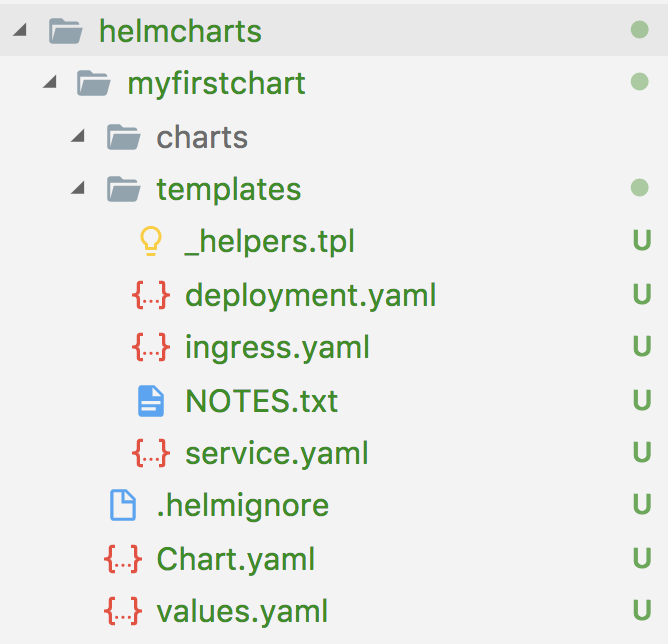

# Packaging Helm charts onto Azure Storage as a repository

## Assumptions

This guide assumes:

- You have access to a Kubernetes cluster (Minikube or on Azure)
- You have the [Azure CLI installed](https://docs.microsoft.com/en-us/cli/azure/install-azure-cli?view=azure-cli-latest)
- You have [authenticated](https://docs.microsoft.com/en-us/cli/azure/get-started-with-azure-cli?view=azure-cli-latest) the Azure CLI

## Installing Helm

Follow the instructions on the Helm install document to [install Helm](https://github.com/kubernetes/helm/blob/master/docs/install.md) on your system. Make sure you have a valid Kubernetes configuraton (either Minikube oran actual Kubernetes cluster).

## Creating your first chart

1. Create a local directory to store the packaged Helm charts. This will most likely happen on your CI/CD pipeline later.

    ```sh
    mkdir helmpackages
    ```

1. Create a local directory to to store your development charts YAML. 

    ```sh
    mkdir helmcharts
    cd helmcharts
    ```

1. Then run the command below to create the chart scaffolding

    ```sh
    helm create myfirstchart
    ```
    you should now have a directory structure like the below:
    

## Creating a repository on Azure Storage

There a a couple of ways that you can use to store the packaged Helm charts. In this guide, you'll store them onto an Azure Storage account.

The steps below are loosely based on the guide posted by [Michal Cwienczek](https://cwienczek.com/setting-up-secure-helm-chart-repository-on-azure-blob-storage/).

1. Create a Resource Group

    ```sh
    az group create --name helmgroup --location "westeurope"
    ```

1. Create an Azure Storage account

    ```sh
    export AZURE_STORAGE_ACCOUNT=<unique storage account name>

    az storage account create --resource-group helmgroup --name $AZURE_STORAGE_ACCOUNT --sku Standard_LRS
    ```

1. Get the Storage Account Name and Key
    ```sh
    export AZURE_STORAGE_KEY=$(az storage account keys list --resource-group helmgroup --account-name $AZURE_STORAGE_ACCOUNT | grep -m 1 value | awk -F'"' '{print $4}')
    ```

1. Create a blob container to hold your packages

    ```sh
    export CONTAINER_NAME=helm
    az storage container create --name $CONTAINER_NAME
    ```

1. Create a read-only Shared Access Signature (SAS) for the container

    ```sh
    export CONTAINER_SAS=$(az storage container generate-sas --name $CONTAINER_NAME --expiry 2020-01-01 --permissions lr -o tsv)
    ```
## Packaging your chart

Call the `helm package` command with the path where the chart code lives. You'll also pass in the destination as ``helmpackages`` to store the `.tgz` files there.

```sh
helm package ./myfirstchart --destination ../helmpackages
```

You should see an output similar to the below

```sh
Successfully packaged chart and saved it to: ../helmpackages/myfirstchart-0.1.0.tgz
```

## Indexing your new chart

Now that you have a new chart, it is time to re-index your chart repository. Note that this step will probably happen on your CI/CD pipeline.

```sh
helm repo index .../helmpackages/
```

This will generate an `index.yaml` file in the `../helmpackages` directory that looks like this

```yaml
apiVersion: v1
entries:
  myfirstchart:
  - apiVersion: v1
    appVersion: "1.0"
    created: 2018-04-18T15:11:09.427936+04:00
    description: A Helm chart for Kubernetes
    digest: 6cad75cdf65cbb6aa41e93d27184fc1c233f3f374cceef8ff2a0305c938dae3c
    name: myfirstchart
    urls:
    - myfirstchart-0.1.0.tgz
    version: 0.1.0
generated: 2018-04-18T15:11:09.427503+04:00
```

## Uploading your chart and index

Now that you have your chart packaged, it is time to upload it to Azure Storage.

```sh
az storage blob upload -f ../helmpackages/myfirstchart-0.1.0.tgz -c $CONTAINER_NAME -n myfirstchart-0.1.0.tgz
```

You will also need to upload the updated index

```sh
az storage blob upload -f ../helmpackages/index.yaml -c $CONTAINER_NAME -n index.yaml
```

## Adding the repository

1. Construct the Azure Blob Storage URL with the container SAS

    ```sh
    export CUSTOM_HELMREPO="https://$AZURE_STORAGE_ACCOUNT.blob.core.windows.net/$CONTAINER_NAME/?$CONTAINER_SAS"
    ```

1. Add the repo to the Helm client

    ```sh
    helm repo add myrepo $CUSTOM_HELMREPO
    ```

1. List the charts in the repo

    ```sh
    helm search myrepo
    ```

    you should find something like this

    ```
    NAME               	CHART VERSION	APP VERSION	DESCRIPTION
    myrepo/myfirstchart	0.1.0        	1.0        	A Helm chart for Kubernetes
    ```

## Deploying from the repository

Now that you have this configured, to deploy this chart to your Kubernetes cluster you run the below

```sh
helm install myrepo/myfirstchart
```

In a few moments the chart will be deployed and you'll get an output similar to the below

```
NAME:   ungaged-markhor
LAST DEPLOYED: Wed Apr 18 15:15:48 2018
NAMESPACE: default
STATUS: DEPLOYED

RESOURCES:
==> v1beta2/Deployment
NAME                          DESIRED  CURRENT  UP-TO-DATE  AVAILABLE  AGE
ungaged-markhor-myfirstchart  1        1        1           0          1s

==> v1/Service
NAME                          TYPE       CLUSTER-IP    EXTERNAL-IP  PORT(S)  AGE
ungaged-markhor-myfirstchart  ClusterIP  10.0.191.179  <none>       80/TCP   1s


NOTES:
1. Get the application URL by running these commands:
  export POD_NAME=$(kubectl get pods --namespace default -l "app=myfirstchart,release=ungaged-markhor" -o jsonpath="{.items[0].metadata.name}")
  echo "Visit http://127.0.0.1:8080 to use your application"
  kubectl port-forward $POD_NAME 8080:80
```